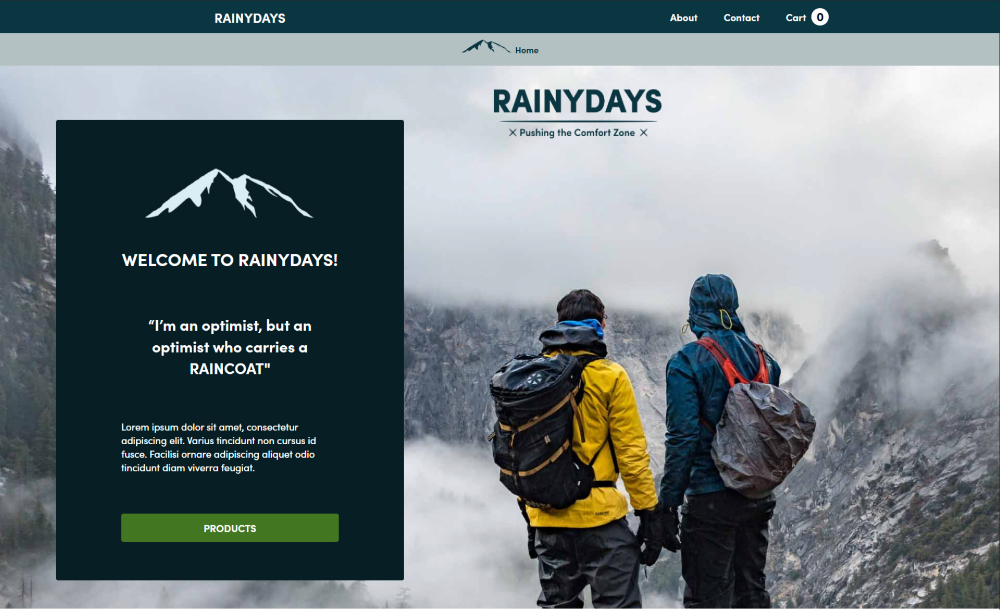

# Rainydays



A simple website that display and sell raincoats.

## Description

This is a school project which we were given a task to create a functional website that sells raincoats.
We used plain HTML, CSS and JS to build the site. 
The products are from WordPress "WooCommerce" plugin, where we created several different items to display dynamicall on our site.
Rainydays has several different pages:
- Home
- About
- Contact
- Products
- Specific-product

The cart function still needs some work, and is not 100% functional.

## Built With

- HTML
- CSS
- JS
- Wordpress API

## Getting Started

### Installing

Clone the repo:

```bash
git clone https://github.com/ddyrnes/cross-course-project-ddyrnes
```

## Contact

dev.dyrnes@gmail.com

[My LinkedIn page](https://www.linkedin.com/in/daniel-dyrnes-3a478a253/)
